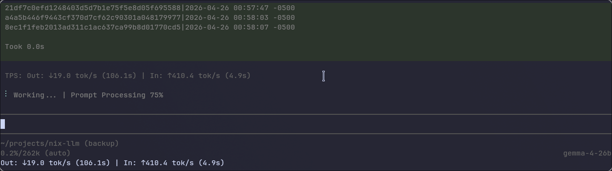

# [Pi](https://github.com/badlogic/pi-mono/tree/main/packages/coding-agent) extensions for [llama.cpp](https://github.com/ggerganov/llama.cpp) power users

[](https://badge.fury.io/js/@kushagharahi%2Fpi-llama-extensions)

## Features
- Configure models only in llama.cpp
  - Auto model discovery in router mode -- you no longer have to duplicate what's in llama.cpp's `models.ini` in pi's `models.json`
  - Takes the first model as the default on load
- Performace metrics in the Pi TUI
  - Tokens/second display
  - Prompt Processing % display



## Quick start
```
pi install npm:@kushagharahi/pi-llama-extensions
```

### models.json config for auto model discovery in router mode

Ensure that you have the following config for auto model discovery from llama.cpp's router mode. The two pieces of important info are the provider key `llama-cpp` and the model array having one `"id": "llama-cpp-discover"`.

`models.json`:
```json
{
  "providers": {
    "llama-cpp": {
      "baseUrl": "http://127.0.0.1:8080",
      "api": "openai-completions",
      "apiKey": "local",
      "models": [
        { "id": "llama-cpp-discover" } 
      ]
    }
  }
}
```

The extension will then autofill things like model id, name, contextLength, maxTokens.

## Debug
Set `LLAMA_CPP_EXTENSION_DEBUG=1` to enable verbose logging. Each extension writes to its own file:

| Extension | Log file |
|-----------|----------|
| Auto Model Discovery | `/tmp/llama-cpp-auto.log` |
| TPS Display | `/tmp/llama-cpp-tps.log` |
